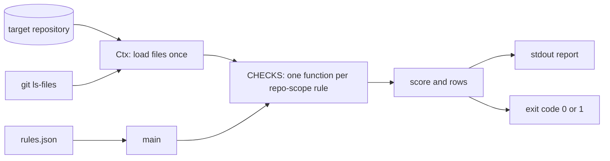

<!-- SPDX-License-Identifier: CC-BY-SA-4.0 -->
<!-- SPDX-FileCopyrightText: Netresearch DTT GmbH -->

# Architecture

This repository ships one agent skill, `typo3-site-conformance`, with a bundled rule catalogue and a command-line checker. This document describes the parts, how they interact and how data flows through the checker. It matches the code at the version it is committed with; the security properties are in [SECURITY-ASSURANCE.md](SECURITY-ASSURANCE.md).

## Components

| Component | Files | Role |
|-----------|-------|------|
| Skill instructions | `skills/typo3-site-conformance/SKILL.md`, `skills/typo3-site-conformance/references/*.md` | Text an AI agent loads. It describes the rule families and tells the agent to run the checker against the repository under review. |
| Rule catalogue source | `skills/typo3-site-conformance/checker/gen_rules.py` | Holds the 76 rules inline as a pinned mirror of the published ruleset, with `CATALOGUE_SNAPSHOT` and `CATALOGUE_SHA256`. Standard library only. |
| Rule catalogue | `skills/typo3-site-conformance/checker/rules.json` | Generated by `gen_rules.py`: code, category, severity, weight and scope (`repo` or `advisory`) per rule. |
| Checker | `skills/typo3-site-conformance/checker/check.py` | Scores a target repository against `rules.json`. Needs PyYAML (declared in the file's PEP 723 metadata block) and uses `git` when it is installed. |
| Tests | `tests/test_check.py` | Behaviour tests for `check.py` and `gen_rules.py`, run by `.github/workflows/tests.yml`. |
| Evals | `evals/evals.json` | Scenarios for the skill, validated by `.github/workflows/eval-validate.yml`. |
| Packaging | `composer.json`, `plugin.json`, `.claude-plugin/plugin.json` | Composer package metadata and the plugin manifests. |

## Actors

- **User**: asks an agent to assess a TYPO3 site repository, or runs `check.py` directly.
- **AI agent**: loads `SKILL.md` and the references, runs `python3 checker/check.py <repo>` (SKILL.md, Workflow step 2) and, when asked to harden the repository, changes it and scores it again (step 4).
- **Target repository**: the TYPO3 site or project repository under review. The checker only reads it.
- **Maintainers and CI**: edit the catalogue in `gen_rules.py`, regenerate `rules.json`, and release the skill.

## Checker data flow

1. **Input.** `main()` takes the target path from the first argument (default `.`) and reads `rules.json` from the checker's own directory.
2. **Loading.** `Ctx.__init__` reads each input once. The Composer project root is `app/` when `app/composer.json` exists, else the repository root. From the project root it reads `composer.json`, `config/system/settings.php` and `config/system/additional.php`; from the repository root `compose.yaml`, `compose.override.yaml`, `Dockerfile`, `.gitlab-ci.yml`, `ci/pipeline.yml` (as text, comment-stripped text and parsed YAML), every `ci/**/*.yml`, `.gitignore` and `.env.dist` (parsed into variables with `${VAR:-default}` expansion). YAML is parsed with a `SafeLoader` subclass that turns unknown tags such as `!reset` into `null`; unreadable YAML or JSON counts as absent. Files are decoded as UTF-8 with undecodable bytes replaced.
3. **On-demand reads.** Individual checks read `ofelia/config.ini`, `README.md`, the `CLAUDE.md` symlink and `config/sites/*/config.yaml`, test for paths such as `build/`, `ansible/` and `docker-compose.yml`, walk the tree for live environment file names (skipping `.git`), and ask `git` whether `.env` is tracked and which files are tracked (`git -C <root> ls-files`). Without `git`, the `.env` checks fall back to the `.gitignore` text and the vendoring check (SC-016) is skipped.
4. **Evaluation.** For every rule in `rules.json`, an `advisory` rule is reported with its note from `ADVISORY_NOTE`; a `repo` rule runs its function from `CHECKS`, which returns a pass flag and a detail string.
5. **Scoring.** Weights come from `rules.json` (error 10, warning 5, info 1). The score is `round(100 × (max − penalty) / max)` over the repo-scope rules.
6. **Output.** One coloured row per rule (`PASS`, `FAIL`, `ADVISORY`, `SKIP`), the score with its band, and the list of failing codes on standard output. The exit code is 0 when no repo-scope rule fails, else 1.

The checker writes no file and opens no network connection. `gen_rules.py` writes `rules.json` next to itself and prints a drift warning when the inline catalogue no longer matches `CATALOGUE_SHA256`.

## External dependencies

| Dependency | Used by | Declared in |
|------------|---------|-------------|
| Python 3 | `check.py`, `gen_rules.py`, tests | README.md, SKILL.md |
| PyYAML | `check.py` | PEP 723 block in `check.py` (`PyYAML>=6`) |
| git | `check.py` (optional) | README.md, this document |
| `netresearch/composer-agent-skill-plugin` | Composer installation of the skill | `composer.json` |
| Shared workflows in `netresearch/skill-repo-skill` and `netresearch/.github` | CI and releases | `.github/workflows/*.yml` |
